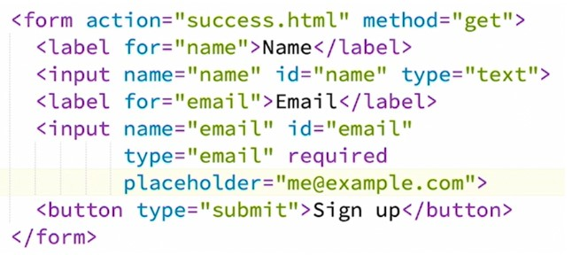

# HTML 101 NOTES
## UNIT 1:10

Hyper Text Markup Language - standard language used to create and design web pages. it provides structure, organize and present information on the internet. it uses tags to define elements such as headings, paragraphs, links, images ect allowing the browser to display content accordingly.

"The purpose of HTML markup is to give meaning to the content and help computers understand it, It serves as a bridge between the human and computer worlds"

HTML is "straightforward structure without any programming logic, loops, or functions. It is known as a declarative language. The code simply declares instructions like "This is a paragraph!" or "Make this a link!" or "Put a form field here!". It is all about using the right vocabulary and making declarations".

### HTML ELEMENTS & TAGS
Tags open with a less-than sign (<) and close with
a greater-than sign (>),You must include the slash ( / ) in the closing tag.

### Capabilities
Html Aria(Accesible Rich Internet application): defines a way to make web content and web applications more accessible to people with disabilities.
### Working with Graphics and Media
1. The ability to embed images on a website has resulted in more visually appealing and interesting content.
2. To put a simple image on a web page, we use the  element,this is a void element that requires two attributes to be useful: src and alt.
3. ALT-  which provides a text description of the image
4. The src attribute contains a URL pointing to the image the src attribute can be a relative URL or an absolute URL. Without a src attribute, an  element has no image to load
 <!---'''html[<a href = http://www.example.com/xyz.html> #Absolute --->
<!---<a href = "/xyz.html">  #Relative]'''--->
5. Audio and video have an opening and closing tag, unlike the image element.
6. embed is inserting adio and video into a browser, this tag causes the browser itself to include controls for the multimedia automatically provided browser supports.
7. iframe is taking medea from one brower to another, this element has attributes like height and width that can be adjusted.

### Content idenfification
The lang attribute specifies the primary language of the element or document. e.g html lang="en-US".

The 
 tag is used a as block part of the webpage, the div tag is used to make divisions of the content on the web pages like text, images, header, footer, navigation bar.

The span element is used to group elements for styling purposes (by using the class or id attributes).the  tag is used as an inline par.

### Forms and Interactive Elements
It is important to use semantic form elements in HTML instead of divs and spans because it allows us to leverage the built-in power of the browser. This way, we avoid wasting time and effort trying to recreate functionalities that already exist in the browser. Moreover, by using HTML form elements, we ensure that forms will be compatible with all devices and input/output hardware, even those we may not be familiar with.

CSS can be used to style forms to render much better than simple text boxes. Proper semantic HTML elements can be used in forms to style them, creating a custom look and feel.

### HTML Tables
Create an HTML table, you use several different HTML elements in just the right combination. Table, TR, TH, and TD.

.png>)

###

